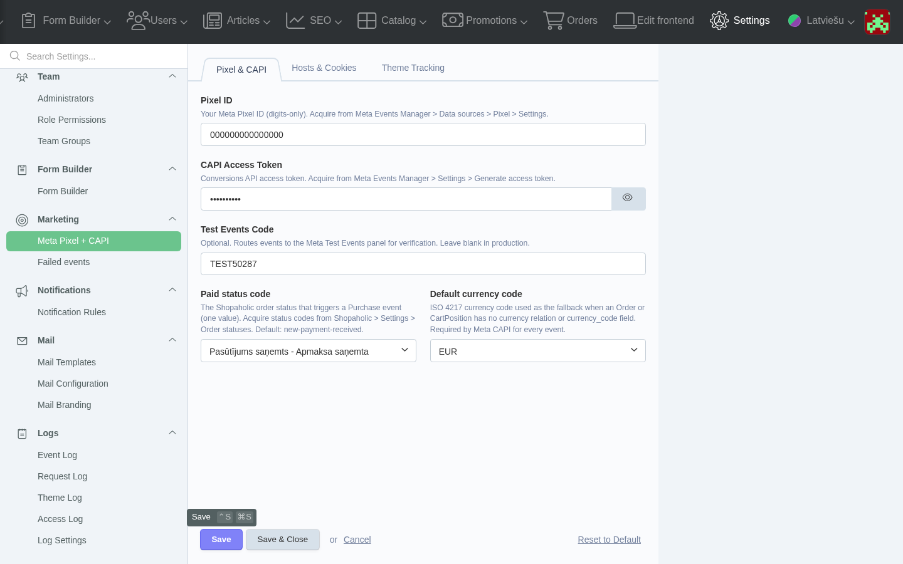
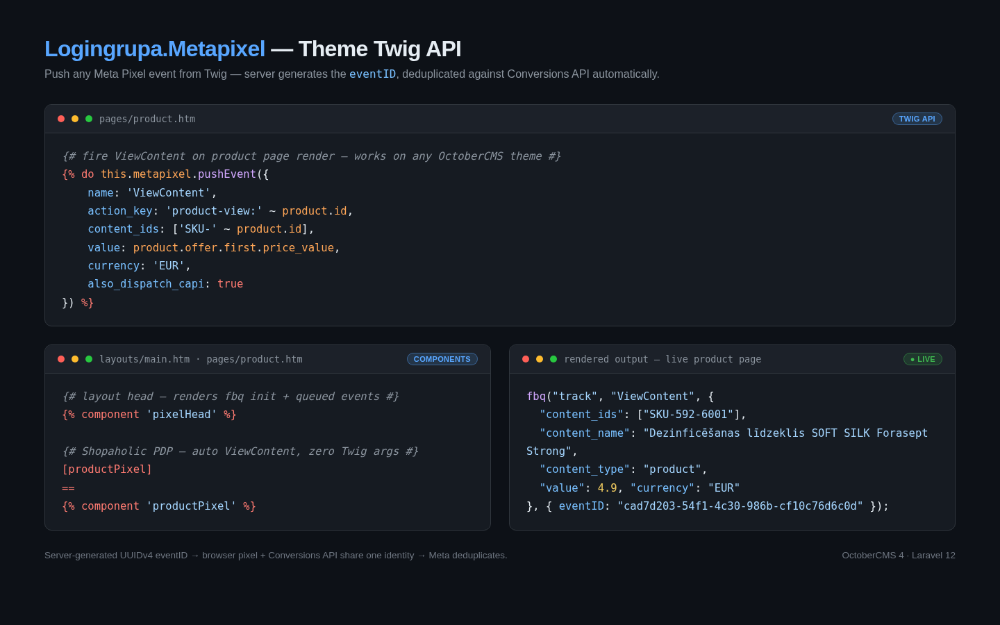
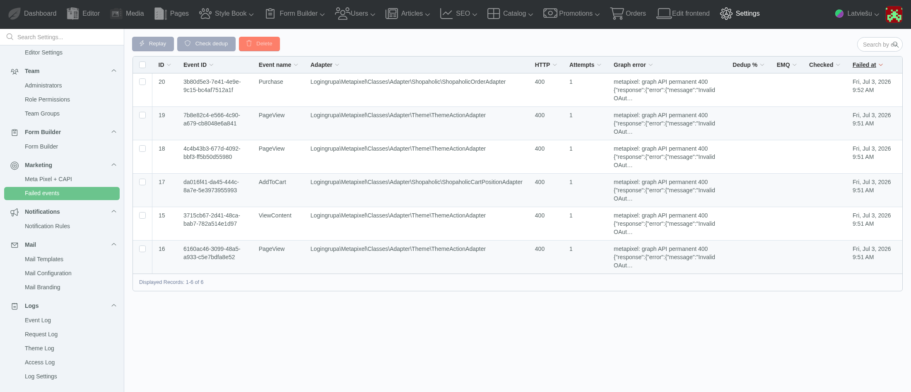
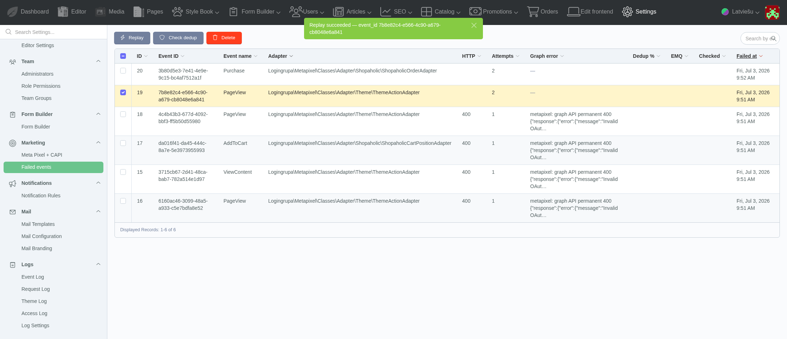
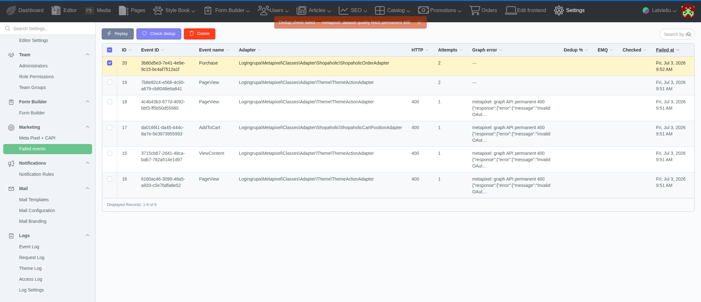

# Meta Pixel + Conversions API for OctoberCMS

Server-deduplicated Meta Pixel and Conversions API (CAPI) tracking for OctoberCMS 4.x, built on a Lovata-style extensible adapter pattern. One pipeline tracks any subject — a Shopaholic order, a theme action, or a third-party cart — and every browser Pixel event is matched to its server CAPI twin by a shared `event_id`, so Meta counts each conversion once.

## Overview

This plugin lets you:

* **fire browser Pixel + server CAPI events in one step**, deduplicated on a shared server-generated `event_id` (Meta collapses the twin within its match window);
* **track Shopaholic orders automatically** — Purchase and AddToCart events ship the moment `Lovata.OrdersShopaholic` is enabled, with `SKU-{product_id}[-{offer_id}]` content IDs matching the Facebook Catalog feed;
* **track any theme action** on a Lovata-free install through a single Twig API call, with no cart plugin required;
* **replay failed CAPI events** from a backend admin list, and check the deduplication rate reported by Meta;
* **run multi-site** with a separate Pixel ID and access token per site, isolated so a token never leaks across sites;
* **register custom adapters** from your own plugin to track any model through the same pipeline, without editing plugin core.

## Requirements

* OctoberCMS 4.x on Laravel 12.
* PHP 8.3 or 8.4.
* `lovata/toolbox-plugin` 2.2 or newer (the plugin backbone).
* A Meta Pixel and a Conversions API access token — see [Acquire Meta credentials](#acquire-meta-credentials).
* Optional: `lovata/shopaholic-plugin` + `lovata/ordersshopaholic-plugin` for automatic order tracking. Without them the plugin still runs — you track through the theme Twig API instead.

## How deduplication works

Meta counts a conversion once when the browser Pixel event and the server CAPI event share the same `event_id` and arrive within Meta's match window. This plugin owns that contract by generating the `event_id` **server-side** and reusing it for the browser Pixel emission — the direction is always server to browser, never the reverse.

Each dispatched event is written to an append-only event log keyed on subject, event name, and channel (`capi` or `pixel`), which fences duplicate sends under concurrent requests. If a CAPI send fails after its retries, the event is dead-lettered to the [Failed events](#failedevents-ui) list rather than dropped, so you can replay it once the cause is fixed.

## Install

Add this VCS repository to your project's `composer.json` so Composer can locate the package. Composer reads `repositories` **before** it resolves any `require` entry, so configure this first:

```json
{
  "repositories": [
    {"type": "vcs", "url": "https://github.com/logingrupa/oc-metapixel-plugin"}
  ]
}
```

Register your OctoberCMS gateway before you require anything. On a fresh install `october/system` and the `lovata/*` backbone are only reachable through the authenticated `gateway.octobercms.com` repository, which `project:set` wires in — substitute your own October project license key for `<license>`:

```bash
php artisan project:set <license>
```

Then require the package and run the migrations:

```bash
composer require logingrupa/oc-metapixel-plugin -W
php artisan october:migrate
```

The `-W` (with-all-dependencies) flag is required because a fresh October lockfile pins `composer/installers` at the ~1.0 line that `lovata/toolbox-plugin ^2.2` must move — without `-W` Composer refuses to update that shared constraint and the require fails.

If **Settings → Marketing → Meta Pixel + CAPI** is not visible after install, run `php artisan october:migrate` to apply the plugin migrations — the settings panel and the failed-events table are created by that step.

Install the exact package name `logingrupa/oc-metapixel-plugin` from the VCS URL `https://github.com/logingrupa/oc-metapixel-plugin`. Do not install a similarly named package.

### Quick start — first event in 10 minutes

The shortest path from a fresh OctoberCMS 4.x app to a verified hit in the Meta Test Events panel:

1. Add the VCS `repositories` entry above to your project's `composer.json`.
2. Register the October gateway: `php artisan project:set <license>` (your own project license key).
3. Require the plugin: `composer require logingrupa/oc-metapixel-plugin -W`.
4. Run the migrations: `php artisan october:migrate`.
5. Enter the four required fields under **Settings → Marketing → Meta Pixel + CAPI**: **Pixel ID**, **CAPI Access Token**, **Test Events Code**, and **Default currency code**. **Save**.
6. Mount the head Pixel in your layout. Declare `[pixelHead]` in the layout's INI/config section **and** place `` in the layout markup. The Twig tag alone renders nothing — without the `[pixelHead]` INI declaration October emits an empty string (HTTP 200, no `fbq()`, no log signature).
7. Load any front-end page and confirm the event appears in **Meta Events Manager → Test Events**.

The full Install, Configure, and walkthrough sections below expand each step.

## Configure

All configuration lives in the backend — you never place a Pixel ID or access token in `.env` or in a source file. Storing secrets through the backend keeps them server-side and out of your git history.

1. Sign in to the OctoberCMS backend and open **Settings → Marketing → Meta Pixel + CAPI**.
2. On the **Pixel & CAPI** tab, fill in:
   * **Pixel ID** — your Meta Pixel ID (digits only).
   * **CAPI Access Token** — the Conversions API access token for that Pixel.
   * **Test Events Code** — optional; routes events to the Meta Test Events panel for verification. Leave blank in production.
   * **Paid status code** — the Shopaholic order status that triggers a Purchase event. Default: `new-payment-received`.
   * **Default currency code** — the ISO 4217 currency used as a fallback when a subject has no currency of its own (Meta CAPI requires a currency on every event).
3. On the **Theme Tracking** tab, fill in:
   * **Custom theme event names** — operator-supplied event names your theme is allowed to send through the Twig API, one per line. Standard Meta events (PageView, ViewContent, AddToCart, Purchase, Lead) are always allowed and do not need to be listed.
4. On the **Hosts & Cookies** tab, fill in:
   * **Trusted Hosts** — one host per line; the plugin sets `_fbp` / `_fbc` cookies only on these hosts. Sub-domains resolve through the bundled Public Suffix List.
   * **Set _fbp / _fbc cookies server-side** — turn this off if your theme already writes these cookies, or if a consent banner must gate them until opt-in.
5. Click **Save**. A confirmation flash appears and the values persist across reloads.



### Per-site setup

On a multi-site install, pick the target site from the backend top-bar site picker **before** you open the settings panel. The **Pixel ID** and **CAPI Access Token** you enter are scoped to the selected site; every other field is shared. See [Multi-site routing](#multi-site-routing) below for the isolation guarantee.

## Acquire Meta credentials

Follow these steps in Meta Events Manager. No screenshots are provided here on purpose — the Meta UI changes often, and these plain-text steps stay accurate:

1. Open **Meta Events Manager → Data sources → Pixel → Settings** and copy the **Pixel ID** (digits only). Paste it into the **Pixel ID** field.
2. On the same screen choose **Generate Access Token** and copy the token. Paste it into the **CAPI Access Token** field.
3. Optionally open **Test Events** on the same screen and copy the **Test Event Code**. Paste it into **Test Events Code** to route events to the Meta Test Events live view while you verify the setup, then clear it for production.

Never commit an access token to git and never place it in `.env`. Enter it through the backend settings panel, which stores it server-side.

## Shopaholic walkthrough

This is the Run A path: a store running `Lovata.Shopaholic` + `Lovata.OrdersShopaholic`. The order adapter registers itself automatically when `Lovata.OrdersShopaholic` is enabled — there is no adapter code to write.

The step sequence below is the exact sequence exercised during the live smoke test:

1. **Configure the Pixel.** Backend → **Settings → Marketing → Meta Pixel + CAPI**: set **Pixel ID** and **CAPI Access Token**, **Save**, reload to confirm persistence.
2. **Place a guest order.** Add a product to the cart, choose a shipping method, choose a payment method, and complete checkout to reach the order-complete page at `/{lang}/checkout/{secret_key}`.
3. **Transition the order to paid.** The Purchase event fires on the **status transition to the Paid status code** (`new-payment-received`), not at order creation. Open the order in the backend, set its status to your paid status, and **Save**. The server CAPI Purchase dispatches immediately.
4. **Confirm browser dedup.** Revisit the order-complete page. The browser Pixel fires a `Purchase` carrying the **server** `event_id`, and the plugin writes the matching `channel=pixel` twin row alongside the `channel=capi` row — Meta collapses the pair.
5. **Verify ViewContent.** Open a product page. `ViewContent` fires as a browser Pixel event and a CAPI event sharing one `event_id`.
6. **Verify PageView.** Load any page. Exactly one `PageView` request reaches Meta per page load.

Keep the browser Pixel mounted on the order-complete page — it reuses the server `event_id` so the Purchase dedup twin is written.

## Theme walkthrough

This is the Run B path: a plain OctoberCMS install with no cart plugin. You wire two things — the head Pixel and the event calls.

1. **Mount the head Pixel.** Add the `pixelHead` component to your layout so the base Pixel boot and `PageView` render in `<head>`. A layout has an INI/config section, an optional PHP section, and the Twig markup section, separated by `==`. The `[pixelHead]` INI declaration is required — the Twig tag alone is a silent no-op (October renders it as an empty string with no `fbq()` and no log signature):

   ```twig
   ##
   description = "Default layout"

   [pixelHead]
   ==
   <!DOCTYPE html>
   <html>
   <head>
       
   </head>
   <body>
       
   </body>
   </html>
   ```

2. **Send an event from any page.** Call the theme Twig API where the action happens. For a product view:

   ```twig
   
   ```

   The `action_key` is the dedup anchor for that action; the plugin generates the `event_id` server-side and reuses it for the browser Pixel emission so both channels match.

If you also run Shopaholic, the store theme wires the Pixel through the `pixelHead` component in its layouts and a product-page component on the product template, while the generic `this.metapixel.pushEvent` Twig API stays available for any additional action. Both mechanisms feed the same pipeline.



## FailedEvents UI

When a CAPI dispatch exhausts its retries — for example, an invalid access token returns a Graph API error — the plugin dead-letters the event to a backend list at **Settings → Marketing → Failed events** instead of losing it.

Each row records the event ID, event name, adapter, HTTP status, attempt count, and the Graph error. Two toolbar actions operate on a selected row:

* **Replay** re-dispatches the event through Meta CAPI. On success the attempt count increments and the HTTP status and Graph error clear; the row is kept as an audit record rather than deleted.
* **Check dedup** asks Meta for the deduplication rate and event match quality for the Pixel. This call needs an access token with `ads_read` on the Pixel's ad account; without that scope Meta returns a permission error and the plugin fails safe — it shows the error and leaves the stored dedup values untouched.





The screenshot below shows the fail-safe state when the token lacks `ads_read`: Meta returns a permission error and the plugin leaves the dedup values unchanged rather than overwriting them.



## Troubleshoot

Grep the OctoberCMS runtime log at `storage/logs/system.log` for these signatures. Every signature below is emitted verbatim by the plugin:

| Symptom | `Log::*` signature | Fix |
|---------|--------------------|-----|
| No events fire at all, even though settings are saved | `metapixel: pixel_id is empty — plugin running in disabled mode (events suppressed)` | Set the **Pixel ID** in Settings → Meta Pixel + CAPI → Pixel & CAPI. An empty Pixel ID disables the plugin by design. |
| Order is paid but no Purchase event ships | `metapixel: OrderStatusWatcher payload-build failed` | The order has no currency — set a **Default currency code**, and confirm the order status matches the **Paid status code**. |
| An event is silently dropped, nothing in the event log | `metapixel: EventLogWriter — no adapter registered for subject` | Enable `Lovata.OrdersShopaholic` for the Shopaholic path, or register a custom adapter for that subject. |
| Failed-events rows accumulate and nothing reaches Meta | `metapixel: adapter rehydrate failed — dead-lettered` | A worker restarted with a stale queue — open **Failed events** and **Replay** the affected rows. |
| Event log writes fail | `metapixel: EventLogWriter::record DB write FAILED` | Run `php artisan october:migrate` to ensure the event-log table exists, then check the database connection. |
| ViewContent does not fire on a product page | `metapixel: ProductPageWatcher emission failed` | Confirm the product resolves an offer and a currency; check the surrounding log context for the failing field. |
| A theme `pushEvent` call is rejected | `metapixel: ThemeAjaxHandler failed` | Add the event name to **Custom theme event names** (one per line) if it is not a standard Meta event. |
| `_fbp` / `_fbc` cookies stop refreshing | `PSL snapshot is <N> days old — run php artisan metapixel:refresh-psl` | Run `php artisan metapixel:refresh-psl` to refresh the bundled Public Suffix List. |

## Multi-site routing

On a multi-site OctoberCMS install, the operator selects the target site from the backend top-bar site picker. The **Pixel ID** and **CAPI Access Token** are stored as per-site settings rows, so each site tracks against its own Meta Pixel. Cross-site propagation of these two fields is locked off, which prevents one site's access token from leaking into another site's configuration. Every other setting is shared across sites.

Server-side event dispatch reads the site from the tracked subject itself — never from the incoming request — so an event queued for one site always resolves that site's credentials, regardless of which site's request triggered it.

## Extend with a custom adapter

The pipeline is subject-agnostic. To track a model the plugin does not know about — a custom cart, a booking, a subscription — register an adapter from your own plugin's `Plugin::boot()`, in order of preference:

1. **Register an adapter** for any subject class:

   ```php
   use Logingrupa\Metapixel\Classes\Adapter\AdapterRegistry;

   App::make(AdapterRegistry::class)->register(\Vendor\Plugin\Models\Booking::class, \Vendor\Plugin\Metapixel\BookingAdapter::class);
   ```

   Your adapter implements the `EventSubjectAdapter` contract (subject metadata + Meta dispatch routing) and returns a `ValueResolver` for value, contents, and currency. It reports its own opaque subject-type alias and reads the site from the subject itself.

2. **Mutate a payload before dispatch** with a halt-able listener. Returning `false` vetoes the send. A listener must never change `event_id` or `event_time` — those anchor the dedup contract:

   ```php
   Event::listen('metapixel.event.before_dispatch', function (string $sEventName, array &$arPayload) {
       // enrich $arPayload here; return false to veto
   });
   ```

3. **Observe successful dispatches** with `metapixel.event.after_dispatch`, or **permanent failures** with `metapixel.event.dead_letter` — both are observe-only taps, useful for your own alerting.

4. **Swap the HTTP transport** for testing or an alternative backend by binding `MetaClientInterface` in the service container.

Register only what you need; the plugin ships with the Shopaholic order adapter and the theme-action adapter already wired.

## CHANGELOG

See [CHANGELOG.md](CHANGELOG.md) for the full release history.

## License

This plugin is proprietary; the `license` field in [composer.json](composer.json) is authoritative. Contact the author listed there for licensing terms.
